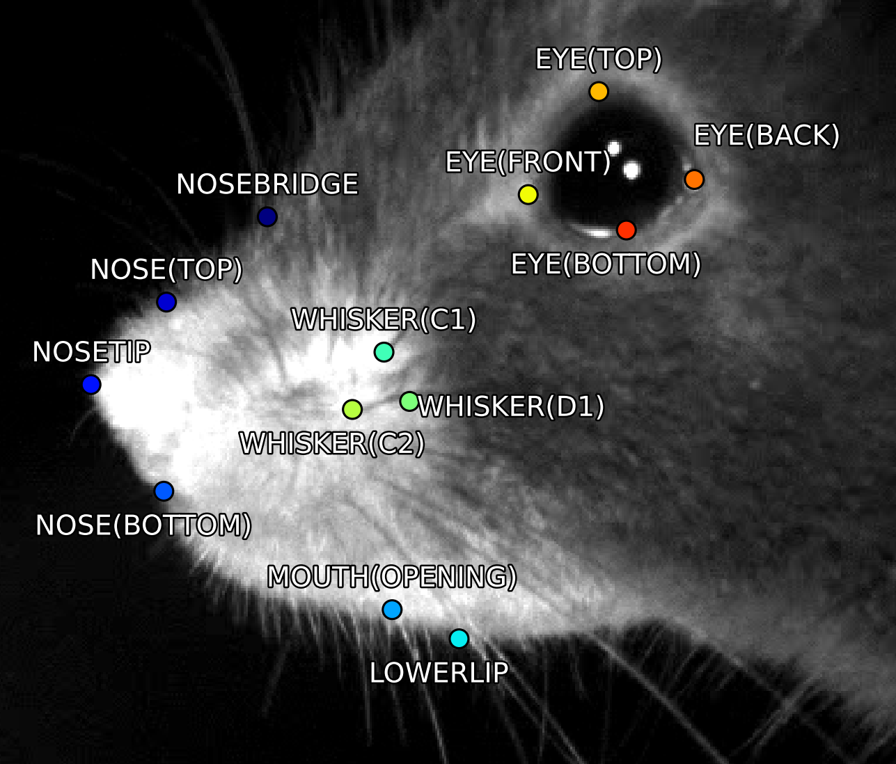
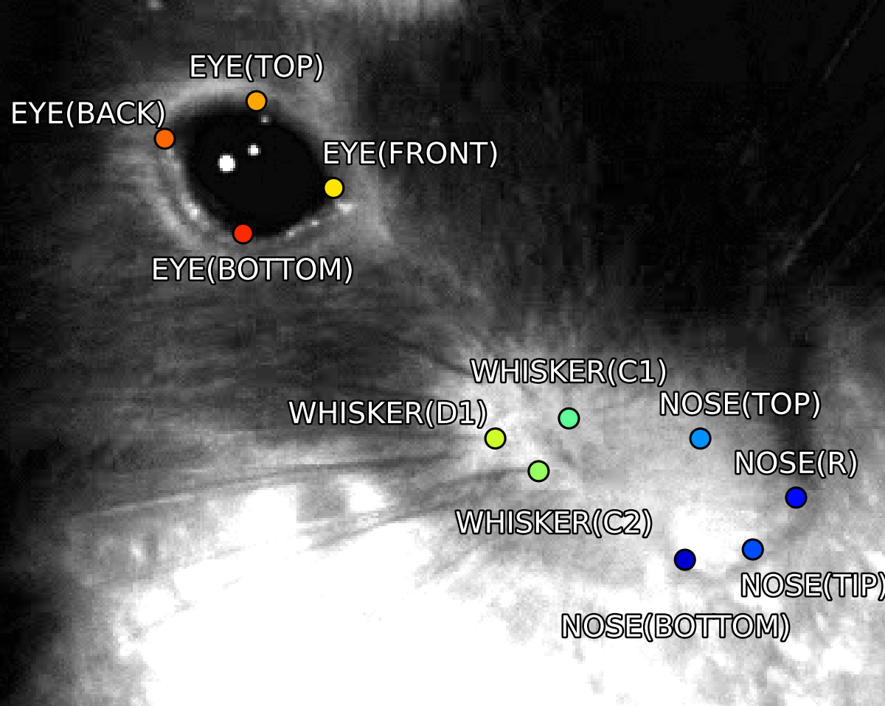

[](https://pepy.tech/project/facemap)
[](https://pepy.tech/project/facemap)
[](https://github.com/MouseLand/facemap/stargazers)
[](https://github.com/MouseLand/facemap/network/members)
[](https://github.com/MouseLand/facemap/blob/main/LICENSE)
[](https://badge.fury.io/py/facemap)
[](https://pypi.org/project/facemap/)
[](https://github.com/MouseLand/facemap/issues)

# Facemap 

Facemap is a single framework for predicting neural activity from mouse orofacial movements. It includes a pose estimation model for tracking distinct keypoints on the mouse face and a neural network model for predicting neural activity using the pose estimates. Facemap also supports singular value decomposition (SVD) of behavioral videos. 

## [Installation](https://github.com/MouseLand/facemap/blob/dev/docs/installation.md)

- For the latest released version (from PyPI):
    - `pip install facemap`

- For the latest development version on github, follow the instructions below:
    1. `git clone https://github.com/MouseLand/facemap.git`
    2. Change directory to facemap folder containing the `environment.yml` file
    3. `conda env create -f environment.yml`
    4. `conda activate facemap`
    5. `python -m facemap`

- Recommended installation instructions using the environment.yml:

    1. Download the `environment.yml` file from the repository
    2. Open an anaconda prompt / command prompt with `conda` for **python 3** in the path
    3. Run `conda env create -f environment.yml`
    4. To activate facemap environment, run `conda activate facemap`
    5. You should see `(facemap)` on the left side of the terminal line. Next, run `python -m facemap` to launch facemap.

- To upgrade Facemap ([PyPI package](https://pypi.org/project/facemap/)), within the environment run:   
    - `pip install facemap --upgrade`

## Supported videos
Facemap supports grayscale and RGB movies. The software can process multi-camera videos for pose tracking and SVD analysis. Please see [example movies](https://drive.google.com/open?id=1cRWCDl8jxWToz50dCX1Op-dHcAC-ttto) for testing the GUI. Movie file extensions supported include:

'.mj2','.mp4','.mkv','.avi','.mpeg','.mpg','.asf'

For more details, please refer to the [data acquisition page](docs/data_acquisition.md).


# I. Pose tracking


Facemap provides a trained network for tracking distinct keypoints on the mouse face from different camera views (some examples shown below). The process for tracking keypoints is as follows:
 1. Load video. (Optional) Use the file menu to set output folder.
 2. Click `process` (Note: check `keypoints` for this step).
 3. Select bounding box.
 4. The processed keypoints `*.h5` file will be saved in the output folder along with the corresponding metadata file `*.pkl`.

Keypoints will be predicted in the selected bounding box region so please ensure the bounding box focuses on the face. See example frames [here](figs/mouse_views.png). 


For more details on using the tracker, please refer to the [GUI Instructions](docs/pose_tracking_gui_tutorial.md). See  [command line interface (CLI) instructions](docs/pose_tracking_cli_tutorial.md) and for more examples, please see [tutorial notebooks](https://github.com/MouseLand/facemap/tree/dev/notebooks).

<p float="middle">


</p>


### :mega: User contributions :video_camera: :camera: 
Facemap aims to provide a simple and easy-to-use tool for tracking mouse orofacial movements. The tracker's performance for new datasets could be further improved by expand our training set. You can contribute to the model by sharing videos/frames on the following email address(es): `asyeda1[at]jh.edu` or `stringerc[at]janelia.hhmi.org`.

### Support

For any issues or questions about Facemap, please [open an issue here](https://github.com/MouseLand/facemap/issues).

# II. SVD processing

Facemap provides options for singular value decomposition (SVD) of single and multi-camera videos. SVD analysis can be performed across static frames called movie SVD (`movSVD`) to extract the spatial components or over the difference between consecutive frames called motion SVD (`motSVD`) to extract the temporal components of the video. The first 500 principal components from SVD analysis are saved as output along with other variables. For more details, see [python tutorial](docs/svd_python_tutorial.md). The process for SVD analysis is as follows:
 1. Load video. (Optional) Use the file menu to set output folder.
 2. Click `process` (Note: check `motSVD`  or `movSVD` for this step).
 3. The processed SVD `*_proc.npy` (and `*_proc.mat`) file will be saved in the output folder selected.

### [*HOW TO GUI* (Python)](docs/svd_python_tutorial.md)

([video](https://www.youtube.com/watch?v=Rq8fEQ-DOm4) with old install instructions)


Run the following command in a terminal
```
python -m facemap
```
Default starting folder is set to wherever you run `python -m FaceMap`


### [*HOW TO GUI* (MATLAB)](docs/svd_matlab_tutorial.md)

To start the GUI, run the command `MovieGUI` in this folder. The following window should appear. After you click an ROI button and draw an area, you have to **double-click** inside the drawn box to confirm it. To compute the SVD across multiple simultaneously acquired videos you need to use the "multivideo SVD" options to draw ROI's on each video one at a time.

<div align="center">

</div>

# II. Neural activity prediction

