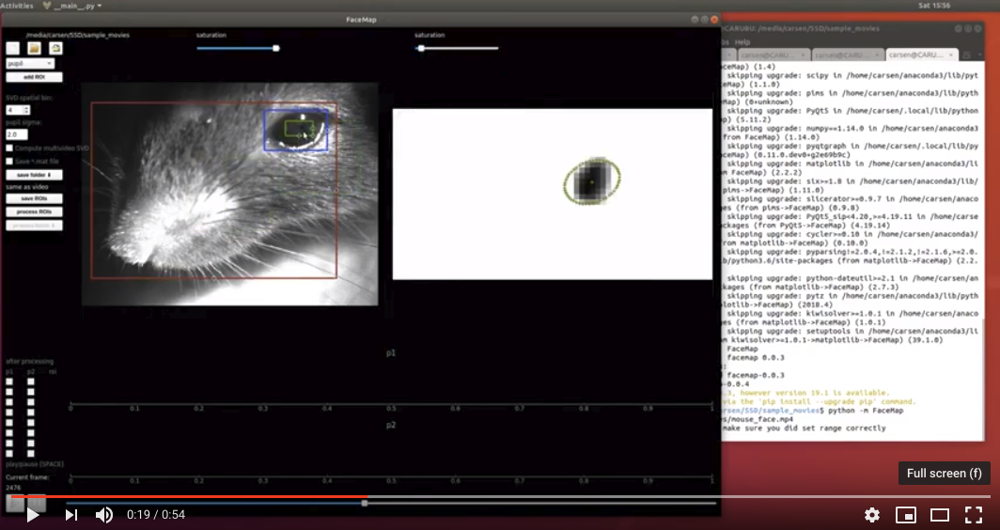
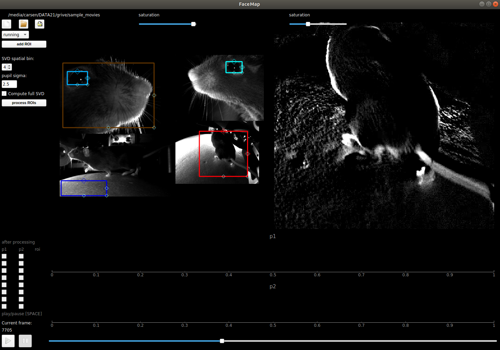
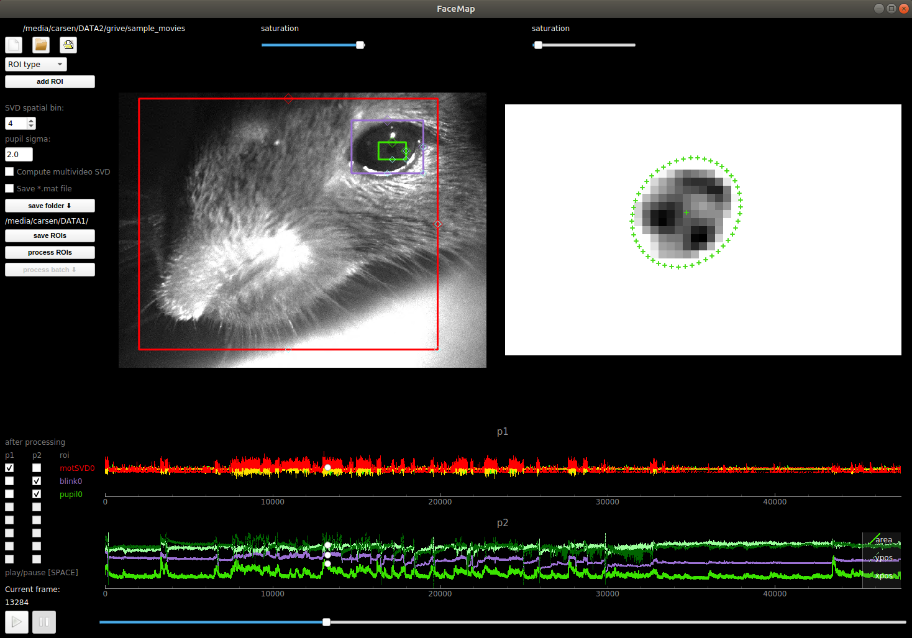
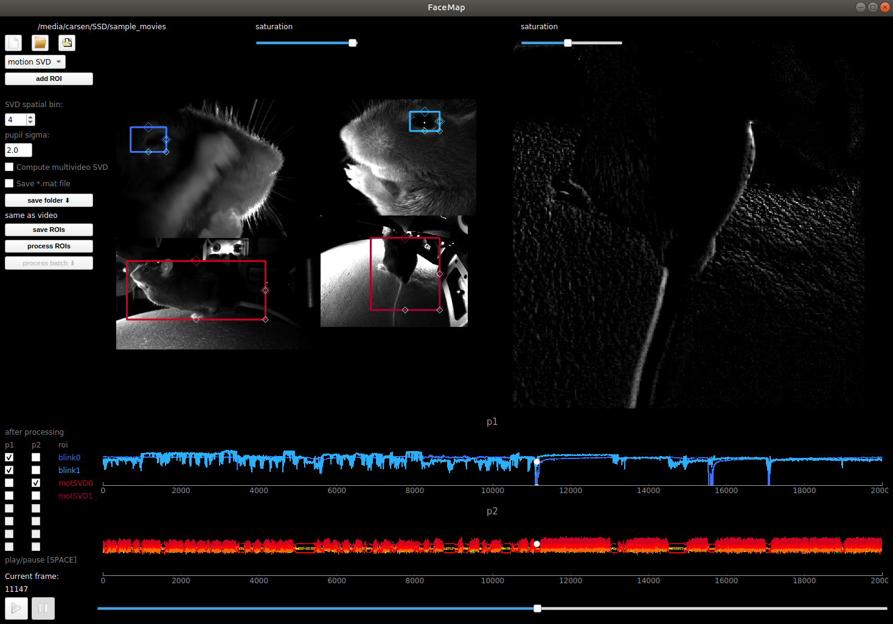

# FaceMap 

GUI for processing videos of rodents, implemented in python and MATLAB. Works for grayscale and RGB movies. Can process multi-camera videos. Some example movies to test the GUI on are located [here](https://drive.google.com/drive/folders/1fOkIXyEsxO-lDGZLy0gCKf1d7OjnUcnQ?usp=sharing). You can save the output from both the python and matlab versions as a matlab file with a checkbox in the GUI (if you'd like to use the python version - it has a better GUI).

## Data acquisition info

IR ILLUMINATION:

For recording in darkness we use [IR illumination](https://www.amazon.com/Logisaf-Invisible-Infrared-Security-Cameras/dp/B01MQW8K7Z/ref=sr_1_12?s=security-surveillance&ie=UTF8&qid=1505507302&sr=1-12&keywords=ir+light) at 850nm, which works well with 2p imaging at 970nm and even 920nm. Depending on your needs, you might want to choose a different wavelength, which changes all the filters below as well. 950nm works just as well, and probably so does 750nm, which still outside of the visible range for rodents.  

If you want to focus the illumination on the mouse eye or face, you will need a different, more expensive system. Here is an example, courtesy of Michael Krumin from the Carandini lab: [driver](https://www.thorlabs.com/thorproduct.cfm?partnumber=LEDD1B), [power supply](https://www.thorlabs.com/newgrouppage9.cfm?objectgroup_id=1710&pn=KPS101#8865), [LED](https://www.thorlabs.com/newgrouppage9.cfm?objectgroup_id=2692&pn=M850L3#4426), [lens](https://www.thorlabs.com/newgrouppage9.cfm?objectgroup_id=259&pn=AC254-030-B#2231), and [lens tube](https://www.thorlabs.com/newgrouppage9.cfm?objectgroup_id=4109&pn=SM1V10#3389), and another [lens tube](https://www.thorlabs.com/thorproduct.cfm?partnumber=SM1L10).

CAMERAS:

We use [ptgrey cameras](https://www.ptgrey.com/flea3-13-mp-mono-usb3-vision-vita-1300-camera). The software we use for simultaneous acquisition from multiple cameras is [BIAS](http://public.iorodeo.com/notes/bias/) software. A basic lens that works for zoomed out views [here](https://www.bhphotovideo.com/c/product/414195-REG/Tamron_12VM412ASIR_12VM412ASIR_1_2_4_12_F_1_2.html). To see the pupil well you might need a better zoom lens [10x here](https://www.edmundoptics.com/imaging-lenses/zoom-lenses/10x-13-130mm-fl-c-mount-close-focus-zoom-lens/#specs).

For 2p imaging, you'll need a tighter filter around 850nm so you don't see the laser shining through the mouse's eye/head, for example [this](https://www.thorlabs.de/thorproduct.cfm?partnumber=FB850-40). Depending on your lenses you'll need to figure out the right adapter(s) for such a filter. For our 10x lens above, you might need all of these:  [adapter1](https://www.edmundoptics.com/optics/optical-filters/optical-filter-accessories/M52-to-M46-Filter-Thread-Adapter/), [adapter2](https://www.thorlabs.de/thorproduct.cfm?partnumber=SM2A53), [adapter3](https://www.thorlabs.de/thorproduct.cfm?partnumber=SM2A6), [adapter4](https://www.thorlabs.de/thorproduct.cfm?partnumber=SM1L03).

## Installation

### PYTHON

From a command line terminal, type:
~~~~
pip install FaceMap
~~~~
If this fails, you might not have Python 3 (or pip, or a recent enough version of pip). You'll need to install a distribution of Python like [Anaconda](https://www.anaconda.com/download/). Choose **Python 3.x** for your operating system. You might need to use an anaconda prompt if you did not add anaconda to the path. Try "pip install suite2p" again. If it still fails, there might be some interaction between pre-installed dependencies and the ones Suite2p needs. First thing to try is
~~~~
python -m pip install --upgrade pip
~~~~
And try "pip install FaceMap" again. If it still fails, install Anaconda, and use the Anaconda command prompt to have a clean environment. Alternatively, if you already have Anaconda, create a clean conda environment just for FaceMap with
~~~~
conda create --name FaceMap
(source) activate FaceMap
pip install FaceMap
~~~~
Omit the "source" on Windows. If you install in this way, you will need to "(source) activate FaceMap" every time you use FaceMap.

To upgrade FaceMap (package [here](https://pypi.org/project/facemap/)), run:
~~~~
pip install FaceMap --upgrade
~~~~

If when running `python -m FaceMap`, you receive the error: `No module named PyQt5.sip`, then try uninstalling and reinstalling pyqt5 (and/or creating a specific environment just for FaceMap)
~~~
pip uninstall pyqt5 pyqt5-tools
pip install pyqt5 pyqt5-tools pyqt5.sip
~~~

If when running `python -m FaceMap`, you receive an error associated with **matplotlib**, try upgrading it:
~~~
pip install matplotlib --upgrade
~~~

If you are on Yosemite Mac OS, PyQt doesn't work, and you won't be able to install FaceMap. More recent versions of Mac OS are fine.

The software has been heavily tested on Ubuntu 18.04, and less well tested on Windows 10 and Mac OS. Please post an issue if you have installation problems. Also, try to follow the instructions that `pip` provides if more drivers are needed to run `pims`.

**Dependencies:**

FaceMap python relies on these awesome packages (which are automatically installed with pip if missing):
- [ffmpeg](https://ffmpeg.org/)
- [pims](http://soft-matter.github.io/pims/v0.4.1/install.html)
- [pyqtgraph](http://pyqtgraph.org/)
- [PyQt5](http://pyqt.sourceforge.net/Docs/PyQt5/)
- [numpy](http://www.numpy.org/) (>=1.13.0, <1.16)
- [scipy](https://www.scipy.org/)
- [matplotlib](https://matplotlib.org/) (not for plotting (only using hsv_to_rgb function), should not conflict with PyQt5)

### MATLAB

The matlab version needs to be downloaded/cloned from github (no install required). It works in Matlab 2014b and above - please submit issues if it's not working. The Image Processing Toolbox is necessary to use the GUI. For GPU functionality, the Parallel Processing Toolbox is required. If you don't have the Parallel Processing Toolbox, uncheck the box next to "use GPU" in the GUI before processing.

### Supported movie files

'.mj2','.mp4','.mkv','.avi','.mpeg','.mpg','.asf'

## Start processing! *HOW TO GUI*

### PYTHON

Here is a youtube video showing how to process and move around the GUI (click on picture)
<div align="center">
  <a href="https://youtu.be/Rq8fEQ-DOm4"></a>
</div>


Run the following command in a terminal
```
python -m FaceMap
```
The following window should appear. The upper left "file" button loads single files, the upper middle "folder" button loads whole folders (from which you can select movies), and the upper right "folder" button loads processed files ("_proc.npy" files). Load a video or a group of videos (see below for file formats for simultaneous videos). The video(s) will pop up in the left side of the GUI. You can zoom in and out with the mouse wheel, and you can drag by holding down the mouse. Double-click to return to the original, full view.

Choose a type of ROI to add and then click "add ROI" to add it to the view. The pixels in the ROI will show up in the right window (with different processing depending on the ROI type - see below). You can move it and resize the ROI anytime. You can delete the ROI with "right-click" and selecting "remove". You can change the saturation of the ROI with the upper right saturation bar. You can also just click on the ROI at any time to see what it looks like in the right view.

By default, the "Compute multivideo SVD" box is unchecked. If you check it, then the motion SVD is computed across ALL videos - all videos are concatenated at each timepoint, and the SVD of this matrix of ALL_PIXELS x timepoints is computed. If you have just one video acquired at a time, then it is the SVD of this video.

<div align="center">

</div>

### Batch processing (python only)

Load a video or a set of videos and draw your ROIs and choose your processing settings. Then click **save ROIs**. This will save a *_proc.npy file in the folder in the specified **save folder**. The name of this proc file will be listed below **process batch** (this button will also activate). You can then repeat this process: load the video(s), draw ROIs, choose settings, and click **save ROIs**. Then to process all the listed *_proc.npy files click **process batch**.

### MATLAB

To start the GUI, run the command `MovieGUI` in this folder. The following window should appear. After you click an ROI button and draw an area, you have to **double-click** inside the drawn box to confirm it. To compute the SVD across multiple simultaneously acquired videos you need to use the "multivideo SVD" options to draw ROI's on each video one at a time.

<div align="center">

</div>

### Default starting folder

**python**: wherever you run `python -m FaceMap`

**MATLAB**: set at line 59 of MovieGUI.m (h.filepath)

## File loading structure

If you choose a folder instead of a single file, it will assemble a list of all video files in that folder and also all videos 1 folder down. The MATLAB GUI will ask *"would you like to process all movies?"*. If you say no, then a list of movies to choose from will appear. By default the python version shows you a list of movies. If you choose no movies in the python version then it's assumed you want to process ALL of them.

### Processing movies captured simultaneously (multiple camera setups)

Both GUIs will then ask *"are you processing multiple videos taken simultaneously?"*. If you say yes, then the script will look if across movies the **FIRST FOUR** letters of the filename vary. If the first four letters of two movies are the same, then the GUI assumed that they were acquired *sequentially* not *simultaneously*.

Example file list:
+ cam1_G7c1_1.avi
+ cam1_G7c1_2.avi
+ cam2_G7c1_1.avi
+ cam2_G7c1_2.avi
+ cam3_G7c1_1.avi
+ cam3_G7c1_2.avi

*"are you processing multiple videos taken simultaneously?"* ANSWER: Yes

Then the GUIs assume {cam1_G7c1_1.avi, cam2_G7c1_1.avi, cam3_G7c1_1.avi} were acquired simultaneously and {cam1_G7c1_2.avi, cam2_G7c1_2.avi, cam3_G7c1_2.avi} were acquired simultaneously. They will be processed in alphabetical order (1 before 2) and the results from the videos will be concatenated in time. If one of these files was missing, then the GUI will error and you will have to choose file folders again. Also you will get errors if the files acquired at the same time aren't the same frame length (e.g. {cam1_G7c1_1.avi, cam2_G7c1_1.avi, cam3_G7c1_1.avi} should all have the same number of frames).

Note: if you have many simultaneous videos / overall pixels (e.g. 2000 x 2000) you will need around 32GB of RAM to compute the full SVD motion masks.

**python**: you will be able to see all the videos that were simultaneously collected at once. However, you can only draw ROIs that are within ONE video. Only the "multivideo SVD" is computed over all videos.

**MATLAB**: after the file choosing process is over, you will see all the movies in the drop down menu (by filename). You can switch between them and inspect how well an ROI works for each of the movies.

## ROI types

### Motion SVD

The motion SVDs (small ROIs / multivideo) are computed on the movie downsampled in space by the spatial downsampling input box in the GUI (default 4 pixels). Note the saturation set in this window is NOT used for any processing.

The motion *M* is defined as the abs(current_frame - previous_frame), and the average motion energy across frames is computed using a subset of frames (*avgmot*) (at least 1000 frames - set at line 45 in [subsampledMean.m](matlab/subsampledMean.m) or line 183 in [facemap.py](FaceMap/facemap.py)). Then the singular vectors of the motion energy are computed on chunks of data, also from a subset of frames (15 chunks of 1000 frames each). Let *F* be the chunk of frames [pixels x time]. Then
```
uMot = [];
for j = 1:nchunks
  M = abs(diff(F,1,2));
  M = M - avgmot;
  [u,~,~] = svd(M);
  uMot = cat(2, uMot, u);
end
[uMot,~,~] = svd(uMot);
uMotMask = normc(uMot(:, 1:500)); % keep 500 components
```
*uMotMask* are the motion masks that are then projected onto the video at all timepoints (done in chunks of size *nt*=500):
```
for j = 1:nchunks
  M = abs(diff(F,1,2));
  M = M - avgmot;
  motSVD0 = M' * uMotMask;
  motSVD((j-1)*nt + [1:nt],:) = motSVD0;
end
```
Example motion masks *uMotMask* and traces *motSVD*:


We found that these extracted singular vectors explained up to half of the total explainable variance in neural activity in visual cortex and in other forebrain areas. See our [paper](https://science.sciencemag.org/content/364/6437/eaav7893) for more details.

### Pupil computation

The minimum pixel value is subtracted from the ROI. Use the saturation bar to reduce the background of the eye. The algorithm zeros out any pixels less than the saturation level (I recommend a *very* low value - so most pixels are white in the GUI).

Next it finds the pixel with the largest magnitude. It draws a box around that area (1/2 the size of the ROI) and then finds the center-of-mass of that region. It then centers the box on that area. It fits a multivariate gaussian to the pixels in the box using maximum likelihood (see [pupil.py](FaceMap/pupil.py) or [fitMVGaus.m](matlab/utils/fitMVGaus.m)).

After a Gaussian is fit, it zeros out pixels whose squared distance from the center (normalized by the standard deviation of the Gaussian fit) is greater than 2 * sigma^2 where sigma is set by the user in the GUI (default sigma = 2.5). It now performs the fit again with these points erased, and repeats this process 4 more times. The pupil is then defined as an ellipse sigma standard deviations away from the center-of-mass of the gaussian.

This raw pupil area trace is post-processed (see [smoothPupil.m](pupil/smoothPupil.m))). The trace is median filtered with a window of 30 timeframes. At each timepoint, the difference between the raw trace and the median filtered trace is computed. If the difference at a given point exceeds half the standard deviation of the raw trace, then the raw value is replaced by the median filtered value.


### Blink computation

You may want to ignore frames in which the animal is blinking if you are looking at pupil size. The blink area is the number of pixels above the saturation level that you set (all non-white pixels).

### Running computation

The phase-correlation between consecutive frames (in running ROI) are computed in the fourier domain (see [running.py](/FaceMap/running.py) or [processRunning.m](/matlab/running/processRunning.m)). The XY position of maximal correlation gives the amount of shift between the two consecutive frames. Depending on how fast the movement is frame-to-frame you may want at least a 50x50 pixel ROI to compute this.

### Multivideo SVD ROIs

**PYTHON**: Check box "Compute multivideo SVD" to compute the SVD of all pixels in all videos.

**MATLAB**: You can draw areas to be included and excluded in the multivideo SVD (or single video if you only have one view). The buttons are "area to keep" and "area to exclude" and will draw blue and red boxes respectively. The union of all pixels in "areas to include" are used, excluding any pixels that intersect this union from "areas to exclude" (you can toggle between viewing the boxes and viewing the included pixels using the "Show areas" checkbox, see example below).


The motion energy is then computed from these non-red pixels.

## Output of processing

The GUIs create one file for all videos (saved in current folder), the npy file has name "videofile_proc.npy" and the mat file has name "videofile_proc.mat".

**PYTHON**:
- **filenames**: list of lists of video filenames - each list are the videos taken simultaneously
- **Ly**, **Lx**: list of number of pixels in Y (Ly) and X (Lx) for each video taken simultaneously
- **sbin**: spatial bin size for motion SVDs
- **Lybin**, **Lxbin**: list of number of pixels binned by sbin in Y (Ly) and X (Lx) for each video taken simultaneously
- **sybin**, **sxbin**: coordinates of multivideo (for plotting/reshaping ONLY)
- **LYbin**, **LXbin**: full-size of all videos embedded in rectangle (binned)
- **fullSVD**: whether or not "multivideo SVD" is computed
- **save_mat**: whether or not to save proc as *.mat file
- **avgframe**: list of average frames for each video from a subset of frames (binned by sbin)
- **avgframe_reshape**: average frame reshaped to be y-pixels x x-pixels
- **avgmotion**: list of average motions for each video from a subset of frames (binned by sbin)
- **avgmotion_reshape**: average motion reshaped to be y-pixels x x-pixels
- **iframes**: array containing number of frames in each consecutive video
- **motSVD**: list of motion SVDs - first is "multivideo SVD" (empty if not computed) - each is nframes x components
- **motMask**: list of motion masks for each motion SVD - each motMask is pixels x components
- **motMask_reshape**: motion masks reshaped to be y-pixels x x-pixels x components
- **pupil**: list of pupil ROI outputs - each is a dict with 'area', 'area_smooth', and 'com' (center-of-mass)
- **blink**: list of blink ROI outputs - each is nframes, the blink area on each frame
- **running**: list of running ROI outputs - each is nframes x 2, for X and Y motion on each frame
- **rois**: ROIs that were drawn and computed
    - *rind*: type of ROI in number
    - *rtype*: what type of ROI ('motion SVD', 'pupil', 'blink', 'running')
    - *ivid*: in which video is the ROI
    - *color*: color of ROI
    - *yrange*: y indices of ROI
    - *xrange*: x indices of ROI
    - *saturation*: saturation of ROI (0-255)
    - *pupil_sigma*: number of stddevs used to compute pupil radius (for pupil ROIs)
    - *yrange_bin*: binned indices in y (if motion SVD)
    - *xrange_bin*: binned indices in x (if motion SVD)

Note this is a dict, so say *.item() after loading:
```
import numpy as np
proc = np.load('cam1_proc.npy').item()
```

These *_proc.npy files can be loaded into the GUI (and will automatically be loaded after processing). The checkboxes in the lower left allow you to view different traces from the processing.

<div align="center">

</div>

**MATLAB**:
- **nX**,**nY**: cell arrays of number of pixels in X and Y in each video taken simultaneously
- **sc**: spatial downsampling constant used
- **ROI**: [# of videos x # of areas] - areas to be included for multivideo SVD (in downsampled reference)
- **eROI**: [# of videos x # of areas] - areas to be excluded from multivideo SVD (in downsampled reference)
- **locROI**: location of small ROIs (in order running, ROI1, ROI2, ROI3, pupil1, pupil2); in downsampled reference
- **ROIfile**: in which movie is the small ROI
- **plotROIs**: which ROIs are being processed (these are the ones shown on the frame in the GUI)
- **files**: all the files you processed together
- **npix**: array of number of pixels from each video used for multivideo SVD
- **tpix**: array of number of pixels in each view that was used for SVD processing
- **wpix**: cell array of which pixels were used from each video for multivideo SVD
- **avgframe**: [sum(tpix) x 1] average frame across videos computed on a subset of frames
- **avgmotion**: [sum(tpix) x 1] average frame across videos computed on a subset of frames
- **motSVD**: cell array of motion SVDs [components x time] (in order: multivideo, ROI1, ROI2, ROI3)
- **uMotMask**: cell array of motion masks [pixels x time]
- **runSpeed**: 2D running speed computed using phase correlation [time x 2]
- **pupil**: structure of size 2 (pupil1 and pupil2) with 3 fields: area, area_raw, and com
- **thres**: pupil sigma used
- **saturation**: saturation levels (array in order running, ROI1, ROI2, ROI3, pupil1, pupil2); only saturation levels for pupil1 and pupil2 are used in the processing, others are just for viewing ROIs

an ROI is [1x4]: [y0 x0 Ly Lx]

### Motion SVD Masks in MATLAB

Use the script [plotSVDmasks.m](figs/plotSVDmasks.m) to easily view motion masks from the multivideo SVD. The motion masks from the smaller ROIs have been reshaped to be [xpixels x ypixels x components].
