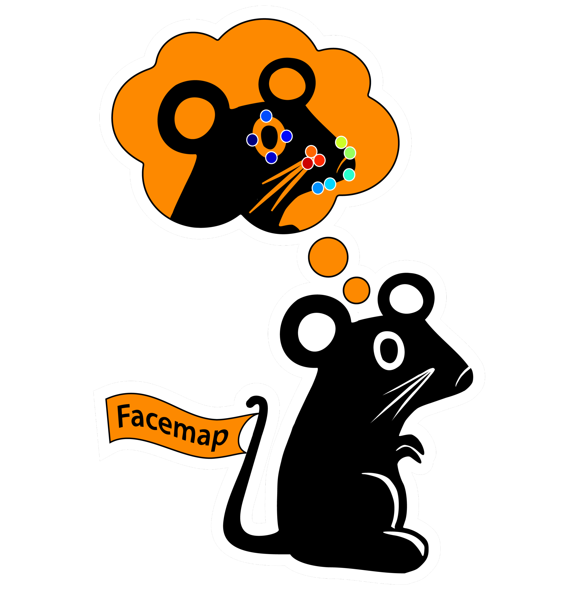

[](https://pepy.tech/project/facemap)
[](https://pepy.tech/project/facemap)
[](https://github.com/MouseLand/facemap/stargazers)
[](https://github.com/MouseLand/facemap/network/members)
[](https://github.com/MouseLand/facemap/blob/main/LICENSE)
[](https://badge.fury.io/py/facemap)
[](https://pypi.org/project/facemap/)
[](https://github.com/MouseLand/facemap/issues)

# Facemap 

Facemap is a single framework for predicting neural activity from mouse orofacial movements. It includes a pose estimation model for tracking distinct keypoints on the mouse face and a neural network model for predicting neural activity using the pose estimates. Facemap also supports singular value decomposition (SVD) of behavioral videos. 

## [Installation](https://github.com/MouseLand/facemap/blob/dev/docs/installation.md)

- For the latest released version (from PyPI):
    - `pip install facemap`

- For the latest development version on github, follow the instructions below:
    1. `git clone https://github.com/MouseLand/facemap.git`
    2. Change directory to facemap folder containing the `environment.yml` file
    3. `conda env create -f environment.yml`
    4. `conda activate facemap`
    5. `python -m facemap`

- Recommended installation instructions using the environment.yml:

    1. Download the `environment.yml` file from the repository
    2. Open an anaconda prompt / command prompt with `conda` for **python 3** in the path
    3. Run `conda env create -f environment.yml`
    4. To activate facemap environment, run `conda activate facemap`
    5. You should see `(facemap)` on the left side of the terminal line. Next, run `python -m facemap` to launch facemap.

- To upgrade Facemap ([PyPI package](https://pypi.org/project/facemap/)), within the environment run:   
    - `pip install facemap --upgrade`

# I. Pose tracking


Facemap provides a trained network for tracking distinct keypoints on the mouse face from different camera views (some examples shown below). The process for tracking keypoints is as follows:
 1. Load video. (Optional) Use the file menu to set output folder.
 2. Click `process` (Note: check `keypoints` for this step).
 3. Select bounding box.
 4. The processed keypoints `*.h5` file will be saved in the output folder along with the corresponding metadata file `*.pkl`.

Keypoints will be predicted in the selected bounding box region so please ensure the bounding box focuses on the face. See example frames [here](figs/mouse_views.png). 


For more details on using the tracker, please refer to the [GUI Instructions](docs/pose_tracking_gui_tutorial.md). See  [command line interface (CLI) instructions](docs/pose_tracking_cli_tutorial.md) and for more examples, please see [tutorial notebooks](https://github.com/MouseLand/facemap/tree/dev/notebooks).

<p float="middle">


</p>


### :mega: User contributions :video_camera: :camera: 
Facemap aims to provide a simple and easy-to-use tool for tracking mouse orofacial movements. The tracker's performance for new datasets could be further improved by expand our training set. You can contribute to the model by sharing videos/frames on the following email address(es): `asyeda1[at]jh.edu` or `stringerc[at]janelia.hhmi.org`.

### Support

For any issues using the software and questions, please [open an issue here](https://github.com/MouseLand/facemap/issues).

# II. Neural prediction model

# III. SVD processing

Works for grayscale and RGB movies. Can process multi-camera videos. Some example movies to test the GUI on are located [here](https://drive.google.com/open?id=1cRWCDl8jxWToz50dCX1Op-dHcAC-ttto). You can save the output from both the python and matlab versions as a matlab file with a checkbox in the GUI (if you'd like to use the python version - it has a better GUI).

Supported movie files:

'.mj2','.mp4','.mkv','.avi','.mpeg','.mpg','.asf'

### Data acquisition info

IR ILLUMINATION:

For recording in darkness we use [IR illumination](https://www.amazon.com/Logisaf-Invisible-Infrared-Security-Cameras/dp/B01MQW8K7Z/ref=sr_1_12?s=security-surveillance&ie=UTF8&qid=1505507302&sr=1-12&keywords=ir+light) at 850nm, which works well with 2p imaging at 970nm and even 920nm. Depending on your needs, you might want to choose a different wavelength, which changes all the filters below as well. 950nm works just as well, and probably so does 750nm, which still outside of the visible range for rodents.  

If you want to focus the illumination on the mouse eye or face, you will need a different, more expensive system. Here is an example, courtesy of Michael Krumin from the Carandini lab: [driver](https://www.thorlabs.com/thorproduct.cfm?partnumber=LEDD1B), [power supply](https://www.thorlabs.com/newgrouppage9.cfm?objectgroup_id=1710&pn=KPS101#8865), [LED](https://www.thorlabs.com/newgrouppage9.cfm?objectgroup_id=2692&pn=M850L3#4426), [lens](https://www.thorlabs.com/newgrouppage9.cfm?objectgroup_id=259&pn=AC254-030-B#2231), and [lens tube](https://www.thorlabs.com/newgrouppage9.cfm?objectgroup_id=4109&pn=SM1V10#3389), and another [lens tube](https://www.thorlabs.com/thorproduct.cfm?partnumber=SM1L10).

CAMERAS:

We use [ptgrey cameras](https://www.ptgrey.com/flea3-13-mp-mono-usb3-vision-vita-1300-camera). The software we use for simultaneous acquisition from multiple cameras is [BIAS](http://public.iorodeo.com/notes/bias/) software. A basic lens that works for zoomed out views [here](https://www.bhphotovideo.com/c/product/414195-REG/Tamron_12VM412ASIR_12VM412ASIR_1_2_4_12_F_1_2.html). To see the pupil well you might need a better zoom lens [10x here](https://www.edmundoptics.com/imaging-lenses/zoom-lenses/10x-13-130mm-fl-c-mount-close-focus-zoom-lens/#specs).

For 2p imaging, you'll need a tighter filter around 850nm so you don't see the laser shining through the mouse's eye/head, for example [this](https://www.thorlabs.de/thorproduct.cfm?partnumber=FB850-40). Depending on your lenses you'll need to figure out the right adapter(s) for such a filter. For our 10x lens above, you might need all of these:  [adapter1](https://www.edmundoptics.com/optics/optical-filters/optical-filter-accessories/M52-to-M46-Filter-Thread-Adapter/), [adapter2](https://www.thorlabs.de/thorproduct.cfm?partnumber=SM2A53), [adapter3](https://www.thorlabs.de/thorproduct.cfm?partnumber=SM2A6), [adapter4](https://www.thorlabs.de/thorproduct.cfm?partnumber=SM1L03).


## [*HOW TO GUI* (Python)](docs/svd_python_tutorial.md)

([video](https://www.youtube.com/watch?v=Rq8fEQ-DOm4) with old install instructions)


Run the following command in a terminal
```
python -m facemap
```
Default starting folder is set to wherever you run `python -m FaceMap`


## [*HOW TO GUI* (MATLAB)](docs/svd_matlab_tutorial.md)

To start the GUI, run the command `MovieGUI` in this folder. The following window should appear. After you click an ROI button and draw an area, you have to **double-click** inside the drawn box to confirm it. To compute the SVD across multiple simultaneously acquired videos you need to use the "multivideo SVD" options to draw ROI's on each video one at a time.

<div align="center">

</div>


