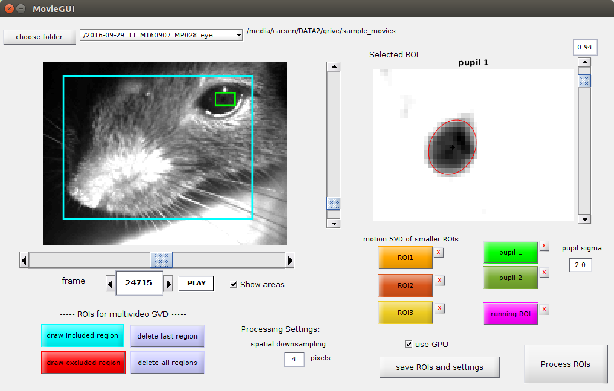
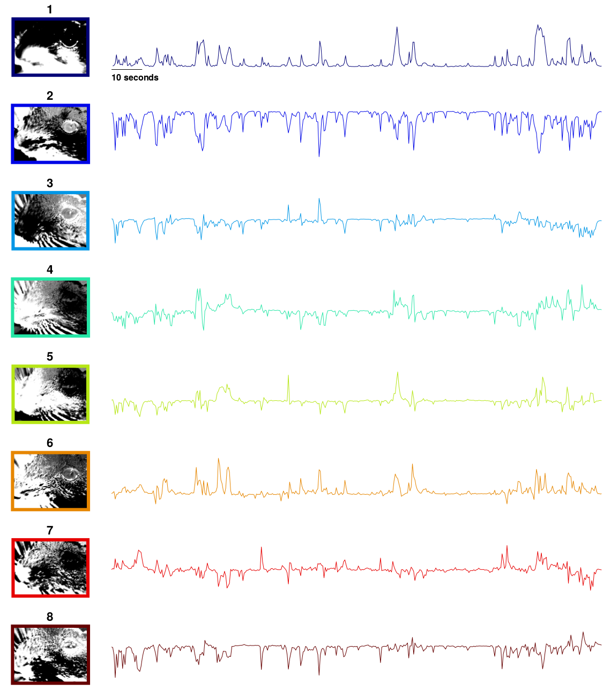

# *HOW TO GUI* (MATLAB)

To start the GUI, run the command `MovieGUI` in this folder. The following window should appear. After you click an ROI button and draw an area, you have to **double-click** inside the drawn box to confirm it. To compute the SVD across multiple simultaneously acquired videos you need to use the "multivideo SVD" options to draw ROI's on each video one at a time.

<div align="center">

</div>

Default starting folder is set at line 59 of MovieGUI.m (h.filepath)

#### File loading structure

If you choose a folder instead of a single file, it will assemble a list of all video files in that folder and also all videos 1 folder down. The MATLAB GUI will ask *"would you like to process all movies?"*. If you say no, then a list of movies to choose from will appear. By default the python version shows you a list of movies. If you choose no movies in the python version then it's assumed you want to process ALL of them.

#### Processing movies captured simultaneously (multiple camera setups)

Both GUIs will then ask *"are you processing multiple videos taken simultaneously?"*. If you say yes, then the script will look if across movies the **FIRST FOUR** letters of the filename vary. If the first four letters of two movies are the same, then the GUI assumed that they were acquired *sequentially* not *simultaneously*.

Example file list:
+ cam1_G7c1_1.avi
+ cam1_G7c1_2.avi
+ cam2_G7c1_1.avi
+ cam2_G7c1_2.avi
+ cam3_G7c1_1.avi
+ cam3_G7c1_2.avi

*"are you processing multiple videos taken simultaneously?"* ANSWER: Yes

Then the GUIs assume {cam1_G7c1_1.avi, cam2_G7c1_1.avi, cam3_G7c1_1.avi} were acquired simultaneously and {cam1_G7c1_2.avi, cam2_G7c1_2.avi, cam3_G7c1_2.avi} were acquired simultaneously. They will be processed in alphabetical order (1 before 2) and the results from the videos will be concatenated in time. If one of these files was missing, then the GUI will error and you will have to choose file folders again. Also you will get errors if the files acquired at the same time aren't the same frame length (e.g. {cam1_G7c1_1.avi, cam2_G7c1_1.avi, cam3_G7c1_1.avi} should all have the same number of frames).

Note: if you have many simultaneous videos / overall pixels (e.g. 2000 x 2000) you will need around 32GB of RAM to compute the full SVD motion masks.

After the file choosing process is over, you will see all the movies in the drop down menu (by filename). You can switch between them and inspect how well an ROI works for each of the movies.

### ROI types

#### Pupil computation

The minimum pixel value is subtracted from the ROI. Use the saturation bar to reduce the background of the eye. The algorithm zeros out any pixels less than the saturation level (I recommend a *very* low value - so most pixels are white in the GUI).

Next it finds the pixel with the largest magnitude. It draws a box around that area (1/2 the size of the ROI) and then finds the center-of-mass of that region. It then centers the box on that area. It fits a multivariate gaussian to the pixels in the box using maximum likelihood (see [pupil.py](facemap/pupil.py) or [fitMVGaus.m](matlab/utils/fitMVGaus.m)).

After a Gaussian is fit, it zeros out pixels whose squared distance from the center (normalized by the standard deviation of the Gaussian fit) is greater than 2 * sigma^2 where sigma is set by the user in the GUI (default sigma = 2.5). It now performs the fit again with these points erased, and repeats this process 4 more times. The pupil is then defined as an ellipse sigma standard deviations away from the center-of-mass of the gaussian. This is plotted with '+' around the ellipse and with one '+' at the center.

If there are reflections on the mouse's eye, then you can draw ellipses to account for this "corneal reflection" (plotted in black). You can add as many of these per pupil ROI as needed. The algorithm fills in these areas of the image with the predicted values, which allows for smooth transitions between big and small pupils.


This raw pupil area trace is post-processed (see [smoothPupil.m](pupil/smoothPupil.m))). The trace is median filtered with a window of 30 timeframes. At each timepoint, the difference between the raw trace and the median filtered trace is computed. If the difference at a given point exceeds half the standard deviation of the raw trace, then the raw value is replaced by the median filtered value.


#### Blink computation

You may want to ignore frames in which the animal is blinking if you are looking at pupil size. The blink area is the number of pixels above the saturation level that you set (all non-white pixels).

#### Motion SVD

The motion SVDs (small ROIs / multivideo) are computed on the movie downsampled in space by the spatial downsampling input box in the GUI (default 4 pixels). Note the saturation set in this window is NOT used for any processing.

The motion *M* is defined as the abs(current_frame - previous_frame), and the average motion energy across frames is computed using a subset of frames (*avgmot*) (at least 1000 frames - set at line 45 in [subsampledMean.m](matlab/subsampledMean.m) or line 183 in [process.py](facemap/process.py)). Then the singular vectors of the motion energy are computed on chunks of data, also from a subset of frames (15 chunks of 1000 frames each). Let *F* be the chunk of frames [pixels x time]. Then
```
uMot = [];
for j = 1:nchunks
  M = abs(diff(F,1,2));
  [u,~,~] = svd(M - avgmot);
  uMot = cat(2, uMot, u);
end
[uMot,~,~] = svd(uMot);
uMotMask = normc(uMot(:, 1:500)); % keep 500 components
```
*uMotMask* are the motion masks that are then projected onto the video at all timepoints (done in chunks of size *nt*=500):
```
for j = 1:nchunks
  M = abs(diff(F,1,2));
  motSVD0 = (M - avgmot)' * uMotMask;
  motSVD((j-1)*nt + [1:nt],:) = motSVD0;
end
```
Example motion masks *uMotMask* and traces *motSVD*:



We found that these extracted singular vectors explained up to half of the total explainable variance in neural activity in visual cortex and in other forebrain areas. See our [paper](https://science.sciencemag.org/content/364/6437/eaav7893) for more details.

In the python version, we also compute the average of *M* across all pixels in each motion ROI and that is returned as the **motion**. The first **motion** field is non-empty if "multivideo SVD" is on, and in that case it is the average motion energy across all pixels in all views.

#### Running computation

The phase-correlation between consecutive frames (in running ROI) are computed in the fourier domain (see [running.py](../facemap/running.py) or [processRunning.m](../matlab/running/processRunning.m)). The XY position of maximal correlation gives the amount of shift between the two consecutive frames. Depending on how fast the movement is frame-to-frame you may want at least a 50x50 pixel ROI to compute this.

#### Multivideo SVD ROIs

You can draw areas to be included and excluded in the multivideo SVD (or single video if you only have one view). The buttons are "area to keep" and "area to exclude" and will draw blue and red boxes respectively. The union of all pixels in "areas to include" are used, excluding any pixels that intersect this union from "areas to exclude" (you can toggle between viewing the boxes and viewing the included pixels using the "Show areas" checkbox, see example below).


The motion energy is then computed from these non-red pixels.

### Proccessed output

The GUIs create one file for all videos (saved in current folder), the processed mat file has name "videofile_proc.mat".

**MATLAB output**:
- **nX**,**nY**: cell arrays of number of pixels in X and Y in each video taken simultaneously
- **sc**: spatial downsampling constant used
- **ROI**: [# of videos x # of areas] - areas to be included for multivideo SVD (in downsampled reference)
- **eROI**: [# of videos x # of areas] - areas to be excluded from multivideo SVD (in downsampled reference)
- **locROI**: location of small ROIs (in order running, ROI1, ROI2, ROI3, pupil1, pupil2); in downsampled reference
- **ROIfile**: in which movie is the small ROI
- **plotROIs**: which ROIs are being processed (these are the ones shown on the frame in the GUI)
- **files**: all the files you processed together
- **npix**: array of number of pixels from each video used for multivideo SVD
- **tpix**: array of number of pixels in each view that was used for SVD processing
- **wpix**: cell array of which pixels were used from each video for multivideo SVD
- **avgframe**: [sum(tpix) x 1] average frame across videos computed on a subset of frames
- **avgmotion**: [sum(tpix) x 1] average frame across videos computed on a subset of frames
- **motSVD**: cell array of motion SVDs [components x time] (in order: multivideo, ROI1, ROI2, ROI3)
- **uMotMask**: cell array of motion masks [pixels x time]
- **runSpeed**: 2D running speed computed using phase correlation [time x 2]
- **pupil**: structure of size 2 (pupil1 and pupil2) with 3 fields: area, area_raw, and com
- **thres**: pupil sigma used
- **saturation**: saturation levels (array in order running, ROI1, ROI2, ROI3, pupil1, pupil2); only saturation levels for pupil1 and pupil2 are used in the processing, others are just for viewing ROIs

an ROI is [1x4]: [y0 x0 Ly Lx]

#### Motion SVD Masks in MATLAB

Use the script [plotSVDmasks.m](../figs/plotSVDmasks.m) to easily view motion masks from the multivideo SVD. The motion masks from the smaller ROIs have been reshaped to be [xpixels x ypixels x components].

