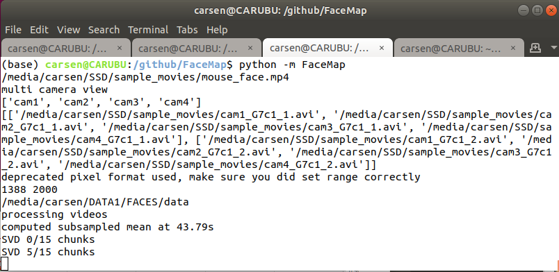

## *HOW TO GUI* (Python)

([video](https://www.youtube.com/watch?v=Rq8fEQ-DOm4) with old install instructions)


Run the following command in a terminal
```
python -m facemap
```
Default starting folder is set to wherever you run `python -m facemap`

The following window should appear. The upper left "file" button loads single files, the upper middle "folder" button loads whole folders (from which you can select movies), and the upper right "folder" button loads processed files ("_proc.npy" files). Load a video or a group of videos (see below for file formats for simultaneous videos). The video(s) will pop up in the left side of the GUI. You can zoom in and out with the mouse wheel, and you can drag by holding down the mouse. Double-click to return to the original, full view.

Choose a type of ROI to add and then click "add ROI" to add it to the view. The pixels in the ROI will show up in the right window (with different processing depending on the ROI type - see below). You can move it and resize the ROI anytime. You can delete the ROI with "right-click" and selecting "remove". You can change the saturation of the ROI with the upper right saturation bar. You can also just click on the ROI at any time to see what it looks like in the right view.

By default, the "Compute multivideo SVD" box is unchecked. If you check it, then the motion SVD is computed across ALL videos - all videos are concatenated at each timepoint, and the SVD of this matrix of ALL_PIXELS x timepoints is computed. If you have just one video acquired at a time, then it is the SVD of this video.

<div align="center">

</div>

Once processing starts, the interface will no longer be clickable and all information about processing will be in the terminal in which you opened FaceMap:
<div align="center">

</div>

If you want to open the GUI with a movie file specified and/or save path specified, the following command will allow this:
~~~
python -m facemap --movie '/home/carsen/movie.avi' --savedir '/media/carsen/SSD/'
~~~
Note this will only work if you only have one file that you need to load (can't have multiple in series / multiple views).

#### Processing movies captured simultaneously (multiple camera setups)

Both GUIs will then ask *"are you processing multiple videos taken simultaneously?"*. If you say yes, then the script will look if across movies the **FIRST FOUR** letters of the filename vary. If the first four letters of two movies are the same, then the GUI assumed that they were acquired *sequentially* not *simultaneously*.

Example file list:
+ cam1_G7c1_1.avi
+ cam1_G7c1_2.avi
+ cam2_G7c1_1.avi
+ cam2_G7c1_2.avi
+ cam3_G7c1_1.avi
+ cam3_G7c1_2.avi

*"are you processing multiple videos taken simultaneously?"* ANSWER: Yes

Then the GUIs assume {cam1_G7c1_1.avi, cam2_G7c1_1.avi, cam3_G7c1_1.avi} were acquired simultaneously and {cam1_G7c1_2.avi, cam2_G7c1_2.avi, cam3_G7c1_2.avi} were acquired simultaneously. They will be processed in alphabetical order (1 before 2) and the results from the videos will be concatenated in time. If one of these files was missing, then the GUI will error and you will have to choose file folders again. Also you will get errors if the files acquired at the same time aren't the same frame length (e.g. {cam1_G7c1_1.avi, cam2_G7c1_1.avi, cam3_G7c1_1.avi} should all have the same number of frames).

Note: if you have many simultaneous videos / overall pixels (e.g. 2000 x 2000) you will need around 32GB of RAM to compute the full SVD motion masks.

You will be able to see all the videos that were simultaneously collected at once. However, you can only draw ROIs that are within ONE video. Only the "multivideo SVD" is computed over all videos.


##### Batch processing (python only)

Load a video or a set of videos and draw your ROIs and choose your processing settings. Then click `save ROIs`. This will save a *_proc.npy file in the output folder. Default output folder is the same folder as the video. Use file menu to change path of the output folder. The name of saved proc file will be listed below `process batch` (this button will also activate). You can then repeat this process: load the video(s), draw ROIs, choose settings, and click `save ROIs`. Then to process all the listed *_proc.npy files click `process batch`.

#### Multivideo SVD ROIs

Check box "Compute multivideo SVD" to compute the SVD of all pixels in all videos.

The GUIs create one file for all videos (saved in current folder), the processed .npy file has name "_proc.npy" which contains:

**PYTHON**:
- **filenames**: list of lists of video filenames - each list are the videos taken simultaneously
- **Ly**, **Lx**: list of number of pixels in Y (Ly) and X (Lx) for each video taken simultaneously
- **sbin**: spatial bin size for motion SVDs
- **Lybin**, **Lxbin**: list of number of pixels binned by sbin in Y (Ly) and X (Lx) for each video taken simultaneously
- **sybin**, **sxbin**: coordinates of multivideo (for plotting/reshaping ONLY)
- **LYbin**, **LXbin**: full-size of all videos embedded in rectangle (binned)
- **fullSVD**: whether or not "multivideo SVD" is computed
- **save_mat**: whether or not to save proc as *.mat file
- **avgframe**: list of average frames for each video from a subset of frames (binned by sbin)
- **avgframe_reshape**: average frame reshaped to be y-pixels x x-pixels
- **avgmotion**: list of average motions for each video from a subset of frames (binned by sbin)
- **avgmotion_reshape**: average motion reshaped to be y-pixels x x-pixels
- **motion**: list of absolute motion energies across time - first is "multivideo" motion energy (empty if not computed)
- **motSVD**: list of motion SVDs - first is "multivideo SVD" (empty if not computed) - each is nframes x components
- **motMask**: list of motion masks for each motion SVD - each motMask is pixels x components
- **motMask_reshape**: motion masks reshaped to be y-pixels x x-pixels x components
- **pupil**: list of pupil ROI outputs - each is a dict with 'area', 'area_smooth', and 'com' (center-of-mass)
- **blink**: list of blink ROI outputs - each is nframes, the blink area on each frame
- **running**: list of running ROI outputs - each is nframes x 2, for X and Y motion on each frame
- **rois**: ROIs that were drawn and computed
    - *rind*: type of ROI in number
    - *rtype*: what type of ROI ('motion SVD', 'pupil', 'blink', 'running')
    - *ivid*: in which video is the ROI
    - *color*: color of ROI
    - *yrange*: y indices of ROI
    - *xrange*: x indices of ROI
    - *saturation*: saturation of ROI (0-255)
    - *pupil_sigma*: number of stddevs used to compute pupil radius (for pupil ROIs)
    - *yrange_bin*: binned indices in y (if motion SVD)
    - *xrange_bin*: binned indices in x (if motion SVD)

The above variables are related to motion energy, which uses the absolute value of differences across frames over time i.e. `abs(np.diff(frame(t+1) - frame(t)))`. To perform SVD computation for each frame over time use the flag `movSVD=True` (default=False) in the `process.run()` function call. Variables pertaining to movie SVDs include:
- movSVD: list of movie SVDs - first is \"multivideo SVD\" (empty if not computed) - each is nframes x components
- movMask: list of movie masks for each movie SVD - each movMask is pixels x component
- movMask_reshape: movie masks reshaped to be y-pixels x x-pixels x components

New variables:
- motSv: array containign singular values for motSVD
- movSv: array containign singular values for movSVD"

 `process.run()` function call takes the following parameters:
 - filenames: A 2D list of names of video(s) to get
 - motSVD: default=True
 - movSVD: default=False
 - GUIobject=None
 - parent: default=None, parent is from GUI
 - proc: default=None, proc can be a saved ROI file from GUI
 - savepath: default=None => set to video folder, specify a folder path in which to save _proc.npy
Note this is a dict, so use the following command for loading processed output:
```
import numpy as np
proc = np.load('cam1_proc.npy', allow_pickle=True).item()
```

The `_proc.npy` files can be loaded into the GUI (and will automatically be loaded after processing). The checkboxes in the lower left allow you to view different traces from the processed video(s).

For example usage, see [notebook](https://github.com/MouseLand/facemap/blob/main/docs/notebooks/process_svd.ipynb).
